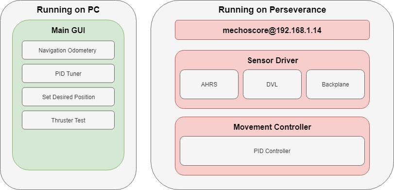
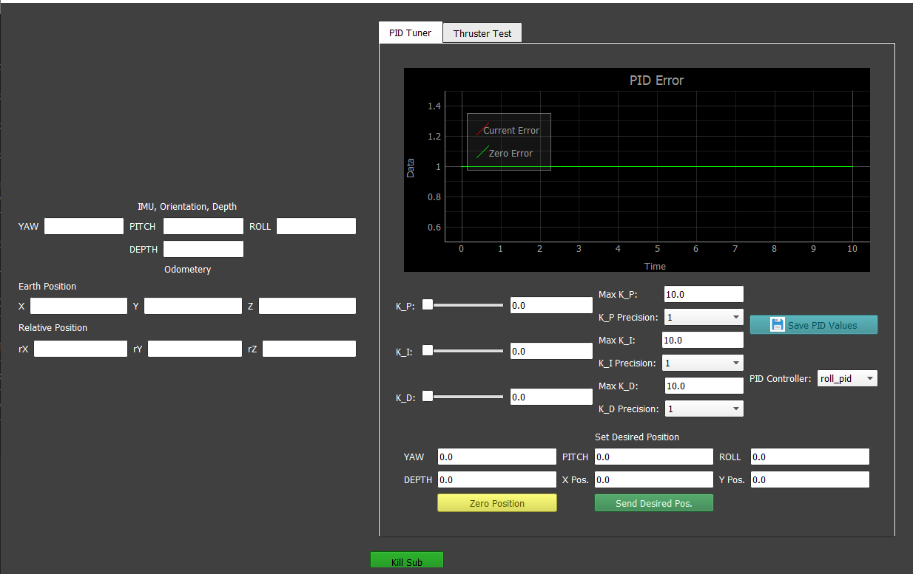

# Perseverance Operation Overview

## Quick Overview 

 

The current operation of Perseverance requires running a couple of Python based processes on the on-board Nvidia Jetson TX2 and the Graphical User Interface (GUI) on your personal PC. The communication between these processes is performed with the MechOS library by way of TCP and UDP IPV4 communication. This library allows publishers and subscribers to share data over a single IP address. This ability allows the on-board computer and PC to connect and communicate easily.

### Starting Up Perseverance

Once power to Perseverance is applied, the computer will need about 20-30 seconds to boot up completely.  Be sure that the Ethernet cable inside the Sub is connected to ethernet port eth0 (the one closest to the HDMI port). Connect the other end of the ethernet cable or SeaCon cable to your personal PC. To check that you are connected successfully, ping the operating IP address on the ethernet port, which is **<u>192.168.1.14</u>**. 

```bash 
ping 192.168.1.14
```

If the ping is successful, then you are ready to **ssh** into the sub to start it up. With the SSH, you will need to be able to open 3 individual terminals to start up the 3 processes that need to be ran on the Sub to operate. If you are on a non-unix based system like Windows, I suggest using **MTPuTTY** to be able to open multiple tabs. NOTE: In order to SSH into the sub, you need to configure the IP address on your PC's ethernet port to match the **<u>192.168.1.*</u>** except the last number. I suggest setting your IP to **<u>192.168.1.1</u>**. 

Once you have SSH'd into the Sub and opened 3 terminals, you are able to start the following three processes.

- **mechoscore**- Mechoscore is the process that allows all of the publishers and subscribers to communicate data, even between two computers.
- **sensor_driver**-Sensor Driver is the process that gathers all the sensor data from each of the sensors, processes it, and publishes it over the MechOS network. 
- **movement_controller**-Movement controller controls the thrusters and movement operations of the sub given the desired positions and orientation of sub using the current sensor data.

In the 3 separate terminals, run the commands

```bash 
sudo python3 -m MechOS.mechoscore --device_ip=192.168.1.14
```

Now navigate to **/home/mechatronics2019/mechatronics-2019/Sub/Src/SensorHub**. Run the following command to start up the sensor driver.

```bash
sudo python3 sensor_driver.py
```

Now navigate to **/home/mechatronics2019/mechatronics-2019/Sub/Src/Dynamics**. Run the following command to start up the movement controller.

```bash
sudo python3 movement_controller.py
```

If all goes well, then all three scripts should start up successfully and produce no errors. 

**TROUBLE SHOOTING**

One common reason that these scripts may not start-up is because the parameters for each script may not be set correctly. In order for the processes to communicate, each of the MechOS nodes must connect to the same IP address and have the correct port configurations. These configurations are set in the file **/home/mechatronics2019/mechatronics-2019/Sub/Src/Params/mechos_network_configs.txt** . Here is what the file should look like (both on the sub and your PC).

```
ip:192.168.1.14
pub_port:5559
sub_port:5560
param_port:8000
xmlrpc_server_path:/home/mechatronics2019/mechatronics-2019/Sub/Src/Params/Perseverance.xml
```

### Starting Up the GUI on you PC

Once everything is started up on the Sub, you should easily be able to start up the GUI. Simply navigate to **/home/mechatronics2019/mechatronics-2019/GUI/Src** and run the command

```bash
python3 main.py
```



You should get something that looks like this.